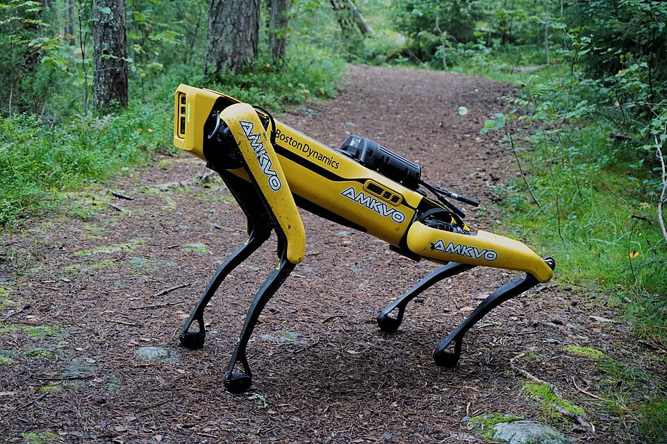

# eyes-on-me

Active perception for Boston Dynamics Spot driven by your head: look left and
Spot looks left. Head orientation comes from the IMU in Sony WH-1000XM5
headphones via [sony-head-tracker](https://github.com/soujanya957/sony-head-tracker)
(submodule); Spot moves through the official `bosdyn-client` SDK.

```
WH-1000XM5 ──BT──▶ sony-head-tracker ──UDP JSON :4243──▶ eyes-on-me ──gRPC──▶ Spot
```

<p align="center">
  
  <br><sub>Spot photo: <a href="https://commons.wikimedia.org/wiki/File:Spot_by_Boston_Dynamics.jpg">Jonte</a>, <a href="https://creativecommons.org/licenses/by-sa/4.0">CC BY-SA 4.0</a>, via Wikimedia Commons</sub>
</p>

## Docs

| doc                          | what                                                                |
| ---------------------------- | ------------------------------------------------------------------- |
| [docs/setup.md](docs/setup.md) | clone, `uv sync`, build the head-tracker bridge, Input Monitoring |
| [docs/run.md](docs/run.md)     | `viz` → `check` → `run`; modes, cameras, arm, keys, e-stop, tuning, safety |
| [docs/testing.md](docs/testing.md) | tier 1: software tests you can run now; tier 2: headphones + Spot hardware checklist |
| [docs/ideas.md](docs/ideas.md) | what else to build on this                                        |

## Quick reference

```bash
./scripts/run-tracker.sh          # terminal 1: head tracker bridge
uv run eyes-on-me viz             # headphones only: 3D gizmo
uv run eyes-on-me check           # robot pre-flight (read-only)
uv run eyes-on-me                 # drive Spot, pose mode
uv run eyes-on-me --mode turn     # + turn in place
uv run eyes-on-me --mode arm      # gripper follows your head, hand cam
./scripts/test-software.sh        # all software tests, no hardware
```

Credentials go in a git-ignored `.env` (`SPOT_IP`, `SPOT_USER`, `SPOT_PASS`);
see `.env.example`.

## Layout

```
eyes_on_me/
  head_tracker.py   UDP JSON receiver (latest-sample, drops stale)
  gaze_mapper.py    pure math: recenter, deadband, gain, smoothing, clamp, turn split
  camera.py         Spot image fetch thread + OpenCV window, yaw-based auto select
  viz.py            `eyes-on-me viz`: headphones-only 3D gizmo
  check.py          `eyes-on-me check`: robot pre-flight
  spot_gaze.py      lease / e-stop / power / arm / control loop
  cli.py            entry point: `eyes-on-me [run|viz|check]`
tests/              pytest, no robot needed
docs/               setup.md, run.md, testing.md, ideas.md
scripts/
  run-tracker.sh    build + start the head-tracker bridge
  fake-tracker.py   synthetic tracker stream for testing without headphones
  test-software.sh  tier-1 test runner
sony-head-tracker/  submodule (fork of NicholasSlattery/sony-head-tracker)
.env.example        template for SPOT_IP / SPOT_USER / SPOT_PASS
```
